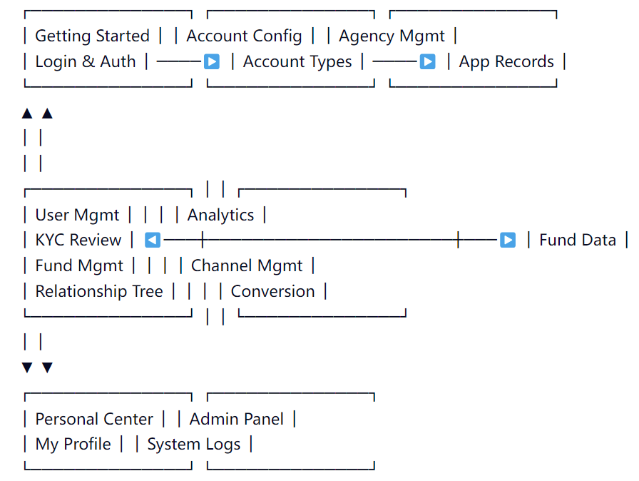

# **CRM Documentation Reading Order and Structure Guide**

## **1. Overall Document Structure Overview**

The official MIM CRM documentation uses a **"Modular + Hierarchical Navigation"** structure, divided into five major categories:

| Category                           | Included Modules                                                             | Target Roles                         |
| ---------------------------------- | ---------------------------------------------------------------------------- | ------------------------------------ |
| **1. Getting Started**       | Preparations, Authorization & Login                                          | All Users                            |
| **2. Account Configuration** | Account Type Setup, Trading Server Overview, Historical Orders               | Admins, IBs                          |
| **3. Agency Management**     | Agency List, Agency Application Records, Commission Settings                 | IBs, Finance, Admins                 |
| **4. User Management**       | User Inquiry, User List, User Relationship Tree, KYC Review, Fund Management | Admins, Compliance Officers, Finance |
| **5. Analytics & Reporting** | Fund Data, Channel Management, Traffic & Conversion Analysis                 | Senior Management, Operations Teams  |

> 📌 Recommended Reading Order: Left to right, from basic to advanced, general to specific.

---

## **2. Recommended Reading Sequence and Learning Path**

### **Phase 1: Onboarding Preparation (For All Users)**

> ✅ Goal: Understand basic concepts and login procedures

1. **Getting Started**
   - 1.1 Preparations: Confirm device environment, browser compatibility, network connection
   - 1.2 Authorization & Login: Learn how to access the system via OAuth or API
   - 🎯 Outcome: Successfully log in and access the dashboard

> 🔍 Tip: This is the foundation for all subsequent operations—complete it first.

---

### **Phase 2: Basic Configuration and Agency Management (For IBs and Admins)**

> ✅ Goal: Master account setup and agency collaboration mechanisms

2. **Account Configuration**

   - 2.1 Account Type Setup: Understand different account types (real vs demo)
   - 2.2 Trading Server Overview: View available trading nodes and latency
   - 2.3 Historical Orders: Learn how to export and analyze past trades
   - 🎯 Outcome: Ability to recommend appropriate accounts to clients
3. **Agency Management**

   - 3.1 Agency List: View all registered IBs and their performance
   - 3.2 Agency Application Records: Process new IB registration requests
   - 3.3 Commission Settings: Configure and monitor IB commission rules
   - 🎯 Outcome: Effective management and incentivization of the agency team

> 💡 Recommendation: IBs and operations staff should prioritize this section.

---

### **Phase 3: Core User and Fund Management (For Admins, Compliance, Finance)**

> ✅ Goal: Full control over user lifecycle and fund flows

4. **User Management**
   - 4.1 User Inquiry / User List: Quickly locate target customers
   - 4.2 User Relationship Tree: Visualize hierarchical relationships between users and IBs
   - 4.3 KYC Review:
     - Pending Review Users → All Users → Pending Withdrawals → All Withdrawals
     - Deep understanding of KYC process, document verification, status transitions
   - 4.4 Fund Management:
     - Pending Deposits / Deposit Records → Pending Withdrawals / Withdrawal Records → Transfer Records → Refund Records
     - Learn how to handle deposit/withdrawal requests securely and compliantly
   - 🎯 Outcome: Full mastery of the entire user lifecycle

> ⚠️ Note: This is the most critical business module—allocate sufficient time.

---

### **Phase 4: Data Analysis and Decision Support (For Senior Management & Ops)**

> ✅ Goal: Drive strategy with data-driven insights

5. **Analytics & Reporting**
   - 5.1 Fund Data: Analyze inflow/outflow trends
   - 5.2 Channel Management: Evaluate acquisition efficiency across channels
   - 5.3 Traffic & Conversion Analysis: Track user journey from registration to trading
   - 🎯 Outcome: Generate reports to guide marketing and product optimization

> 📈 Recommendation: Use with Excel or BI tools for deeper analysis.

---

### **Phase 5: Personal Center & System Maintenance (For All Users)**

> ✅ Goal: Manage personal settings and system logs

6. **Personal Center**

   - My Profile: Update contact info, password, notification preferences
   - Currency & Payment: Bind payment methods, set default currency
   - Payment Channels: View supported banks, wallets, third-party gateways
7. **Admin Panel**

   - Admin List: View permission assignments
   - System Logs: Audit key actions, troubleshoot anomalies

> 🔐 Tip: Admins should regularly check logs for security assurance.

---

## **3. Logical Relationship Diagram Between Modules**

📌 Interpretation:

- **Horizontal Flow**: From "Getting Started" to "Agency Mgmt", reflecting system setup.
- **Vertical Loop**: User Mgmt → Fund Mgmt → Analytics, forming a complete "User → Funds → Decision" cycle.
- **Support Layer**: Personal Center and Admin Panel serve as foundational support for stable operation.

---

## **4. Best Practices**

| Scenario                                  | Recommendation                                                                |
| ----------------------------------------- | ----------------------------------------------------------------------------- |
| **New Employee Onboarding**         | Follow the phased learning path to ensure comprehensive knowledge             |
| **After System Upgrade**            | Prioritize reading updated sections in "Getting Started" and "Account Config" |
| **Compliance Audit**                | Focus on "KYC Review" and "Fund Management" documentation                     |
| **Marketing Campaign Review**       | Combine "Analytics" and "User Mgmt" for attribution analysis                  |
| **Technical Issue Troubleshooting** | Check "System Logs" and "Admin" module records                                |

---

## **5. Frequently Asked Questions (FAQ)**

### **Q1: Which module should I read first?**

- ✅ New users → **Getting Started**
- IBs/Agents → **Agency Management**
- Admins → **User Management + Fund Management**
- Executives → **Analytics & Reporting**

---

### **Q2: Do I need to read every module?**

- ❌ No. Read selectively based on role:
  - Finance staff focus on "Fund Management" and "All Withdrawals"
  - Compliance officers focus on "KYC Review"

---

### **Q3: How do I find a specific feature?**

- ✅ Use the left-side navigation bar to search keywords (e.g., "KYC", "Withdrawal", "Commission")
- Or use Ctrl+F to search within the document

---

### **Q4: Will the documentation be updated?**

- ✅ Yes. It will be updated after each system version release. Always check the "Last Updated" timestamp.

---

## **6. Summary**

The MIM CRM documentation is a **well-structured, logically rigorous, progressive knowledge base**. Following this guide ensures that you can:

✅ Build a complete understanding of the system from scratch✅ Quickly locate required features and workflows✅ Transition smoothly from beginner to expert

> 📌 **Final Advice**:
> Print or save this guide as a PDF to use as your daily “operational handbook”.

---

**Version: v1.0**
**Last Updated: February 2026**
