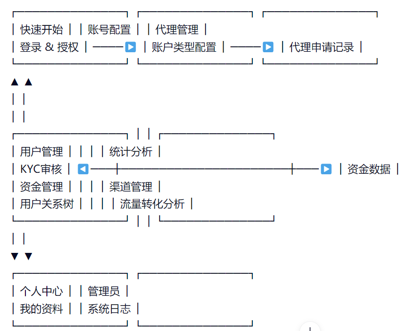

# **CRM 文档阅读顺序与结构指南**

**My Investment Markets (MIM) CRM 系统**
**编写时间：2026年2月**

本指南旨在为新用户、系统管理员、合规官及财务主管提供一份清晰、系统的 **MIM CRM 文档阅读路径与结构说明**。结合此前已发布的多个模块功能文档（如“全部用户”、“待审核提款账户”、“全部提款账户”等），本文将帮助您高效理解平台整体架构，掌握核心操作流程，并快速上手日常运营与管理任务。

---

## **一、文档整体结构概览**

MIM CRM 的官方文档采用 **“模块化 + 层级导航”** 的组织方式，分为五大核心类别：

| 类别                  | 包含模块                                          | 适用角色             |
| --------------------- | ------------------------------------------------- | -------------------- |
| **1. 快速开始** | 开始前准备、授权与登录                            | 所有用户             |
| **2. 账号配置** | 账号类型配置、交易服务器概览、历史订单            | 管理员、IB           |
| **3. 代理管理** | 代理列表、代理申请记录、订单佣金                  | IB、财务、管理员     |
| **4. 用户管理** | 用户查询、用户列表、用户关系树、KYC审核、资金管理 | 管理员、合规官、财务 |
| **5. 统计分析** | 资金数据、渠道管理、流量与转化分析                | 高级管理层、运营团队 |

> 📌 建议阅读顺序：从左至右，由浅入深，先通览后精读。

---

## **二、推荐阅读顺序与学习路径**

### **阶段一：入门准备（适用于所有用户）**

> ✅ 目标：了解系统基本概念与登录流程

1. **《快速开始》**
   - 1.1 开始前准备：确认设备环境、浏览器兼容性、网络连接
   - 1.2 授权与登录：学习如何通过 OAuth 或 API 接入系统，获取访问权限
   - 🎯 成果：成功登录系统，进入主界面

> 🔍 提示：此部分是所有后续操作的基础，请务必完成。

---

### **阶段二：基础配置与代理管理（适用于 IB 与管理员）**

> ✅ 目标：掌握账号设置与代理协作机制

2. **《账号配置》**

   - 2.1 账号类型配置：了解不同账户类型（如真实账户、模拟账户）的用途
   - 2.2 交易服务器概览：查看可用的交易节点与延迟情况
   - 2.3 历史订单：学习如何导出和分析历史交易记录
   - 🎯 成果：能够为客户提供合适的账户配置建议
3. **《代理管理》**

   - 3.1 代理列表：查看所有注册的 IB 及其业绩表现
   - 3.2 代理申请记录：处理新的 IB 注册请求，审核资质
   - 3.3 订单佣金：配置并监控 IB 的佣金分成规则
   - 🎯 成果：实现对代理团队的有效管理与激励

> 💡 建议：IB 和运营人员应优先掌握此部分内容。

---

### **阶段三：核心用户与资金管理（适用于管理员、合规官、财务）**

> ✅ 目标：全面掌控用户生命周期与资金流动

4. **《用户管理》**
   - 4.1 用户查询 / 用户列表：快速定位目标客户
   - 4.2 用户关系树：可视化展示用户与 IB 的层级关系
   - 4.3 KYC 审核：
     - 待审核用户 → 全部用户 → 待审核提款账户 → 全部提款账户
     - 深入理解 KYC 流程、资料验证、审核状态流转
   - 4.4 资金管理：
     - 待办入金 / 入金记录 → 待办出金 / 出金记录 → 转账记录 → 退款记录
     - 学习如何处理资金出入金请求，确保合规与安全
   - 🎯 成果：具备完整的用户全生命周期管理能力

> ⚠️ 注意：这是平台最核心的业务模块，建议投入最多时间学习。

---

### **阶段四：数据分析与决策支持（适用于高级管理层与运营团队）**

> ✅ 目标：基于数据驱动运营策略与绩效评估

5. **《统计分析》**
   - 5.1 资金数据：分析平台总资金流入流出趋势
   - 5.2 渠道管理：评估不同推广渠道的获客效率
   - 5.3 流量与转化分析：追踪用户从注册到交易的完整转化路径
   - 🎯 成果：形成数据报告，指导市场投放与产品优化

> 📈 建议：配合 Excel 或 BI 工具使用，提升分析深度。

---

### **阶段五：个人中心与系统维护（适用于所有用户）**

> ✅ 目标：熟悉个人信息管理与系统日志查看

6. **《个人中心》**

   - 我的资料：更新联系方式、密码、通知偏好
   - 货币与支付：绑定支付方式，管理默认货币
   - 支付通道：查看支持的银行、钱包、第三方支付
7. **《管理员》**

   - 管理员列表：查看系统权限分配
   - 系统日志：审计关键操作行为，排查异常事件

> 🔐 提示：系统管理员需定期检查日志，保障系统安全。

---

## **三、各模块之间的逻辑关系图**

> 📌 解读：
- **横向流程**：从“快速开始”到“代理管理”，体现系统搭建过程。
- **纵向闭环**：用户管理 → 资金管理 → 统计分析，构成“用户→资金→决策”的完整闭环。
- **支撑层**：个人中心与管理员模块作为底层支持，保障系统稳定运行。

---

## **四、最佳实践建议**

| 场景 | 推荐做法 |
|------|----------|
| **新员工入职** | 按照上述阶段顺序培训，确保知识体系完整 |
| **系统升级后** | 优先阅读“快速开始”与“账号配置”更新内容 |
| **合规审计** | 重点查阅“KYC审核”与“资金管理”相关文档 |
| **营销活动复盘** | 结合“统计分析”与“用户管理”进行归因分析 |
| **技术问题排查** | 查看“系统日志”与“管理员”模块的日志记录 |

---

## **五、常见问题解答（FAQ）**

### **Q1：我应该先看哪个模块？**  
- ✅ 新用户 → **快速开始**
- IB/代理 → **代理管理**
- 管理员 → **用户管理 + 资金管理**
- 高管 → **统计分析**

---

### **Q2：文档是否需要全部看完？**  
- ❌ 不必。根据职责选择性阅读即可。例如：
  - 财务人员只需关注“资金管理”与“全部提款账户”
  - 合规官重点学习“KYC审核”流程

---

### **Q3：如何查找某个具体功能？**  
- ✅ 使用左侧导航栏搜索关键词（如“KYC”、“提款”、“佣金”）
- 或在文档中使用 Ctrl+F 快捷键定位

---

### **Q4：文档会更新吗？**  
- ✅ 是的。每次系统版本迭代后，文档将同步更新。请关注“最后更新”时间戳。

---

## **六、总结**

MIM CRM 的文档体系是一个 **结构清晰、逻辑严密、层层递进** 的知识库。遵循本指南的阅读顺序，您可以：

✅ 从零开始构建对系统的全面认知  
✅ 快速定位所需功能与操作路径  
✅ 实现从“新手”到“专家”的平滑过渡  

> 📌 **终极建议**：  
> 将本指南打印或保存为 PDF，作为日常工作的“操作手册”使用。

---

**版本：v1.0**  
**最后更新：2026年2月**