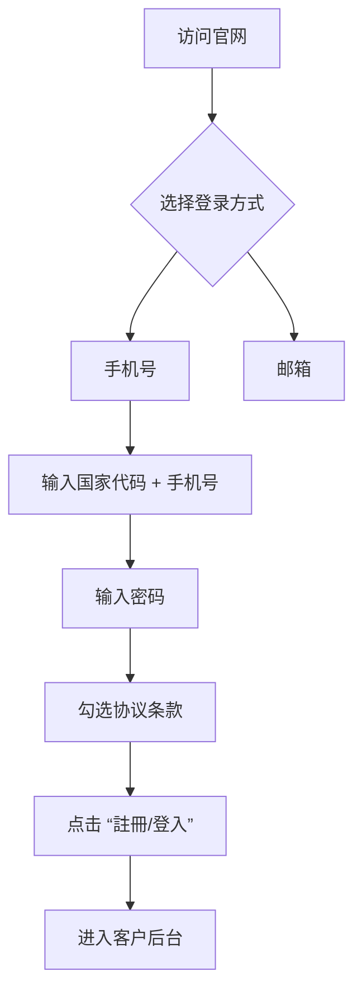

# My Investment Markets (MIM) CRM 登录与注册流程说明

本指南将详细介绍 **My Investment Markets (MIM)** 客户端登录与注册的完整流程，结合界面截图说明操作步骤，帮助用户快速完成账户创建与登录。

---

## 一、首页：注册/登录入口

进入 MIM 官网后，用户将看到主登录页面，包含以下核心功能：

### 页面布局概览

- **左上角 Logo**：`MM My Investment Markets`，点击可返回首页。
- **主题切换按钮**：`白天 / 夜晚`，支持日间与夜间模式切换。
- **左侧背景图**：展示 CRM 后台界面预览，增强专业感与信任度。
- **右侧登录表单区域**：提供手机号或邮箱两种登录方式。

---

### 1. 选择登录方式

用户可在“手機號”和“郵箱”之间切换登录方式：

| 选项 | 说明 |
|------|------|
| ✅ 手機號 | 推荐使用，支持国际号码输入，自动识别国家区号 |
| 📧 郵箱 | 适用于偏好邮箱登录的用户 |

> 默认显示为“手機號”选项。

---

### 2. 输入手机号（以新加坡为例）

#### 步骤：

1. 点击国家代码下拉框（默认为 `+65`）。
2. 从弹出列表中选择目标国家，例如：
   
   - `+65` Singapore（已选中）
   - `+60` Malaysia
   - `+61` Australia
   - `+63` Philippines
   - 等等
3. 在右侧输入框中填写手机号码（如：`81388988`）。

> ✅ 示例：`+65 81388988`

---

### 3. 输入密码并验证

1. 在下方输入密码字段中输入账号密码。
2. 密码需满足系统安全要求，若未填写则提示：
   
   > ❌ **輸入不能為空**
3. 勾选两个必要协议选项：
   
   - ☑ 我已閱讀並同意 **Terms and Conditions**
   - ☑ 我在此確認我不是美國公民。
4. 可选择“使用驗證碼登入”或点击“忘記密碼？？”进行找回。

---

### 4. 提交登录

点击底部黑色按钮：

> 🔹 **註冊/登入**

- 若已有账号 → 直接登录进入客户后台。
- 若无账号 → 进入注册流程（通常由系统引导完成信息补全）。

---

## 二、成功登录后：客户入口主页

登录成功后，跳转至 **MIM 客户中心首页**，界面如下：

### 顶部导航栏

- **语言设置**：当前为「中文-繁體」，可切换其他语言。
- **用户头像与姓名**：显示登录用户信息（如：Stella lili），点击可查看个人资料。
- **通知提示**：绿色提示条显示「成功：語言設定已更改」。

---

### 左侧菜单栏

| 图标 | 菜单项 | 功能说明 |
|------|--------|----------|
| 📊 | 交易 | 快速进入交易平台 |
| 🟡 | 首頁 | 返回主控面板 |
| 💳 | 資金 | 查看资金流水、存款提款 |
| 👤 | 交易帳戶 | 管理多个交易账户 |
| 🤝 | 夥伴 | 查看推荐奖励与邀请链接 |
| 🧑‍💼 | 個人中心 | 修改个人信息、联系方式等 |
| 🔄 | 交易平台 | 下载 MT5、MT4 等交易软件 |

---

### 主内容区

#### 1. 财务概览卡片

| 模块 | 金额 | 功能 |
|------|------|------|
| **總資產** | $7,545.78 | 显示总净值 |
| **MIM AQX 餘額** | $268.29 | 特定账户余额 |
| **MIM BO 餘額** | $132.80 | 另一个子账户余额 |
| **MIM MT5 餘額** | $500.00 | MT5 平台可用资金 |
| **可用餘額** | $6,644.69 | 实际可交易金额 |

> ⭐ 每个卡片右上角有「立即交易」按钮，可快速跳转到对应平台。

---

#### 2. 公告栏（Notifications）

- 显示最新系统通知与消息。
- 示例：
  - `Number of Recipients`（12-08-2025）
  - `System Upgrade Notification`
  - `Welcome to MIM`
- 支持翻页浏览（共 4 条）。

---

#### 3. 欢迎使用 MIM MT5

- 提供多平台下载链接：
  - 📱 **MT5 iOS APP**
  - 🤖 **MT5 Android...**
  - 💻 **MT5 PC**
- 强调其为“Multi-Platform Multi-Trading Server”，支持跨设备交易。

---

#### 4. 邀请与奖励

- 显示用户的专属邀请码与链接：
  - 🎯 **邀請碼**：`9AZFB6`
  - 🔗 **邀請連結**：`https://mimclient.tradewisesoftware.com/#/login/9AZFB6`
- 用户可复制分享给他人，用于推广与奖励计划。

---

#### 5. QR 码

- 右下角提供二维码，扫码可直接访问客户入口或下载客户端。

---

## 三、总结：登录流程图解

